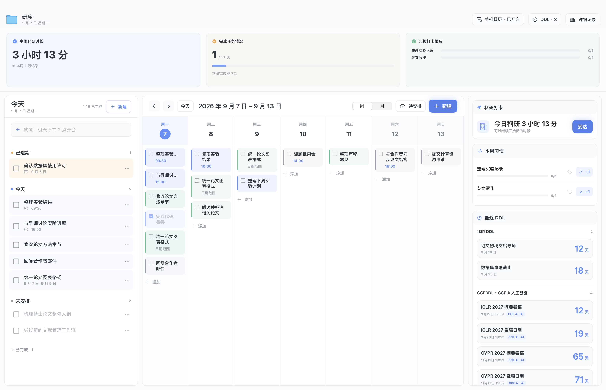

# 研序使用指南

研序的核心是一张适合全屏使用的科研工作台。任务、日历、科研打卡、习惯和 DDL 尽量在同一页完成，减少页面切换。

## 1. 顶部数据看板

顶部看板用于快速了解本周状态：

- **本周科研时长**：汇总本周所有实验室打卡时段。
- **任务完成情况**：显示本周已完成任务与计划任务数量。
- **习惯打卡情况**：汇总各项每周习惯目标的完成进度。

看板只展示当前状态，不与上周比较，避免制造额外信息负担。

## 2. 左侧“今天”

“今天”是每天最常使用的区域，统一显示：

- 已逾期任务；
- 今天的全天任务和具体时间任务；
- 日期范围覆盖今天的任务；
- 尚未安排日期的任务；
- 今天完成的任务。

任务前的方框用于完成打勾。右键任务可以延后一天、编辑或删除。

顶部输入框支持自然语言：

| 输入 | 结果 |
| --- | --- |
| `整理实验数据` | 进入待安排 |
| `下午2点整理报销材料` | 今天 14:00 |
| `今天修改论文` | 今天的全天任务 |
| `明天下午2点开会` | 明天 14:00 |
| `下周五开组会` | 下周五的全天任务 |

## 3. 中间周/月日历

日历是计划工作的主区域，可在周视图和月视图之间切换：

- 周视图适合安排近期任务和查看每天的计划密度；
- 月视图适合查看课程、会议和长期任务分布；
- 双击任务可编辑，右键可延后或删除；
- 完成后的任务仍会保留，但会降低视觉权重。

研序不使用纵向时间轴，避免在全屏工作台中浪费空间。

## 4. 待安排抽屉

点击日历右上角的“待安排”可以展开抽屉：

- 点击抽屉中的 `+`，创建的任务不会附带今天日期；
- 没有输入日期和时间的快速任务也会进入这里；
- 将任务拖到日历中的某一天，即可完成安排。

这个区域适合保存“需要做，但暂时还不知道哪天做”的事项。

## 5. 右侧科研信息

### 科研打卡

到达实验室时开始打卡，离开时结束。一天可以打卡多次，中间休息或外出不会被计入科研时长。历史记录可以修改或删除。

单次打卡连续超过 8 小时时，研序会提醒检查是否忘记打卡离开。可以选择继续计时，也可以填写实际离开的日期和时间，系统会自动重新计算时长。

### 本周习惯

每项习惯设置一个每周次数目标。例如“每周阅读论文 3 次”，每读完一篇即可 `+1`，同一天允许记录多次，也可以撤销误操作。

### 最近 DDL

- “我的 DDL”最多显示最近 2 项；
- “CCF A DDL”显示人工智能方向最近 4 个 CCF A 会议；
- DDL 只负责清晰展示，不发送提醒。

## 6. 新建任务

任务支持四种安排方式：

- **无日期**：保存在待安排；
- **某一天**：当天的全天任务；
- **具体时间**：带开始时间和可选结束时间；
- **日期范围**：在可执行的日期区间内持续显示，完成一次即结束。

有日期的任务默认开启提醒：全天任务当天 09:00，具体时间任务提前 10 分钟，日期范围任务在首日 09:00。

## 7. Apple 日历与 iPhone

开启 Apple 日历同步后：

- 有日期的任务和个人 DDL 会写入 iCloud 中的“研序”日历；
- 应用启动以及日程发生变化后会自动增量同步；
- CCFDDL 公共数据不会同步；
- iPhone 无需安装研序，只要开启同一 Apple ID 的 iCloud 日历即可查看；
- 暂停同步不会删除已经写入 Apple 日历的事项。

Apple 日历属于单向查看入口，请继续在 Mac 版研序中修改任务。

## 8. 桌面小组件

构建并安装包含 WidgetKit 扩展的完整应用包后，可以在 macOS 桌面添加：

- 今天计划；
- 本周计划；
- 最近 DDL。

如果搜索不到小组件，请确认运行的是 `./scripts/build-app.sh` 生成的完整 `YanXu.app`，并已将它放入“应用程序”目录。

## 9. 灵动岛

研序启动后，屏幕顶部会显示一个常驻的灵动岛：

- 收起时，刘海左右分别显示今日科研时长和今日任务完成数；
- 点击灵动岛后，展开为本周七日计划，无需切换回主窗口；
- 展开后点击右上角的太阳/月亮按钮，可切换白天与黑夜模式；研序会自动记住你的选择；
- 周视图中可以直接勾选任务，今天会使用蓝色强调；
- 点击灵动岛以外的任意位置，或点击展开面板右上角的关闭按钮即可收起；
- 收起时可直接拖动整个灵动岛；展开时拖动左上角的图标和“本周计划”标题区域即可移动，位置会自动保存；
- 右键点击可选择“回到屏幕顶部”，恢复默认位置；
- 灵动岛轮廓之外的透明区域不会拦截鼠标点击。

连接多块屏幕时，研序会优先将灵动岛放在有物理刘海的 MacBook 内置屏幕；没有刘海屏幕时使用当前主屏。
